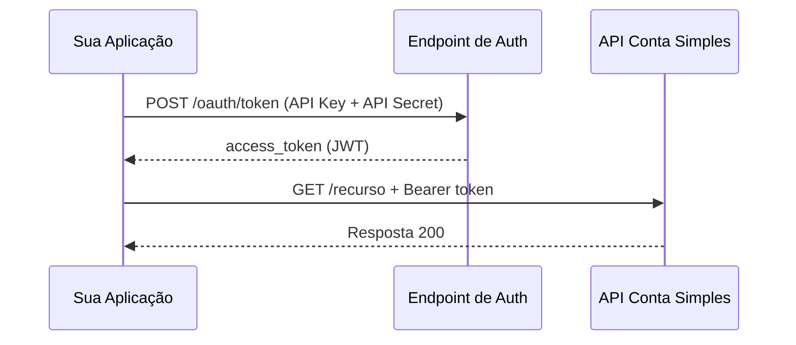

## Visão geral

A API Conta Simples utiliza **OAuth 2.0 Client Credentials** para autenticação. Este fluxo é ideal para comunicação server-to-server onde não há interação de usuário final.



---

## Obtendo o token

### Requisição

Faça uma requisição `POST` para o endpoint de token com suas credenciais (API Key e API Secret obtidas no [Internet Banking](https://ib.contasimples.com/integracoes/api/credenciais)):

```bash
curl -X POST https://api-sandbox.contasimples.com/oauth/token \
  -H "Content-Type: application/x-www-form-urlencoded" \
  -d "grant_type=client_credentials" \
  -d "client_id={SUA_API_KEY}" \
  -d "client_secret={SEU_API_SECRET}"
```

<Note>
Para produção, substitua a URL base por `https://api.contasimples.com`.
</Note>

<Info>
**TODO:** Confirmar URL exata do endpoint de autenticação.
</Info>

### Resposta

```json
{
  "access_token": "eyJhbGciOiJSUzI1NiIsInR5cCI6IkpXVCJ9...",
  "token_type": "Bearer",
  "expires_in": 3600
}
```

| Campo | Descrição |
|-------|-----------|
| `access_token` | Token JWT para autenticação nas chamadas |
| `token_type` | Sempre `Bearer` |
| `expires_in` | Tempo de vida do token em segundos |

---

## Usando o token

Inclua o token em todas as requisições no header `Authorization`:

```bash
curl -X GET https://api-sandbox.contasimples.com/recurso \
  -H "Authorization: Bearer {TOKEN}" \
  -H "Content-Type: application/json"
```

<Warning>
**Nunca** exponha tokens em URLs, logs, ou código client-side. Tokens devem ser tratados como credenciais sensíveis.
</Warning>

---

## Expiração e renovação

### Ciclo de vida do token

<Steps>
  <Step title="Token emitido">
    Token válido por `expires_in` segundos (padrão: 3600 = 1 hora).
  </Step>
  <Step title="Token próximo de expirar">
    Renove o token **antes** da expiração para evitar interrupções.
  </Step>
  <Step title="Token expirado">
    Requisições retornarão `401 Unauthorized`. Obtenha um novo token.
  </Step>
</Steps>

### Boas práticas de renovação

<AccordionGroup>
  <Accordion title="Renovação proativa" icon="clock">
    Renove o token quando faltar ~10% do tempo de vida. Para um token de 1 hora, renove aos 54 minutos.
    
    ```typescript
    // Exemplo conceitual
    if (tokenAge > expiresIn * 0.9) {
      await refreshToken();
    }
    ```
  </Accordion>
  <Accordion title="Cache do token" icon="database">
    Armazene o token em cache (Redis, memória) para evitar múltiplas requisições de autenticação desnecessárias.
  </Accordion>
  <Accordion title="Tratamento de 401" icon="triangle-exclamation">
    Se receber `401`, invalide o cache, obtenha novo token e repita a requisição original.
  </Accordion>
</AccordionGroup>

---

## Headers obrigatórios

Toda requisição autenticada deve incluir:

| Header | Valor | Descrição |
|--------|-------|-----------|
| `Authorization` | `Bearer {TOKEN}` | Token de acesso OAuth 2.0 |
| `Content-Type` | `application/json` | Formato do corpo da requisição |

<Info>
**TODO:** Adicionar headers específicos (X-Request-Id, X-Idempotency-Key, etc.) quando Swagger/OpenAPI estiver disponível.
</Info>

---

## Escopos e permissões

O sistema de escopos controla quais recursos sua aplicação pode acessar.

<Note>
**TODO:** Listar escopos disponíveis (cards:read, cards:write, transactions:read, etc.) quando documentação de escopos estiver disponível.
</Note>

### Conceito de escopos

| Padrão | Descrição |
|--------|-----------|
| `recurso:read` | Permissão de leitura no recurso |
| `recurso:write` | Permissão de escrita (inclui leitura) |
| `recurso:*` | Todas as permissões no recurso |

Se sua aplicação tentar acessar um recurso sem o escopo necessário, receberá `403 Forbidden`.

---

## Segurança

### Armazenamento de credenciais

<Tabs>
  <Tab title="Recomendado">
    - AWS Secrets Manager
    - HashiCorp Vault
    - Azure Key Vault
    - GCP Secret Manager
    - Variáveis de ambiente em runtime (não em código)
  </Tab>
  <Tab title="Evitar">
    - Hardcoded em código fonte
    - Arquivos `.env` commitados
    - Logs de aplicação
    - Repositórios Git (mesmo privados)
    - Planilhas ou documentos compartilhados
  </Tab>
</Tabs>

### Em caso de comprometimento

Se suas credenciais forem comprometidas:

1. **Imediatamente** acesse o [painel de credenciais](https://ib.contasimples.com/integracoes/api/credenciais) no Internet Banking e revogue as credenciais comprometidas
2. Gere novas credenciais pelo mesmo painel
3. Faça rotação em todos os ambientes
4. Investigue logs para identificar uso não autorizado
5. Se necessário, entre em contato com o [suporte](/operacao/suporte)

---

## Troubleshooting

<AccordionGroup>
  <Accordion title="401 Unauthorized" icon="lock">
    **Causas comuns:**
    - Token expirado
    - Token malformado
    - Header `Authorization` ausente ou incorreto
    
    **Solução:** Obtenha um novo token e verifique o formato do header.
  </Accordion>
  <Accordion title="403 Forbidden" icon="ban">
    **Causas comuns:**
    - Escopo insuficiente para o recurso
    - Credenciais não autorizadas para o ambiente
    
    **Solução:** Verifique os escopos das suas credenciais com o time de suporte.
  </Accordion>
  <Accordion title="400 Bad Request no /oauth/token" icon="circle-xmark">
    **Causas comuns:**
    - `grant_type` incorreto
    - API Key ou API Secret inválidos
    - Content-Type incorreto
    
    **Solução:** Verifique se está usando `application/x-www-form-urlencoded` e credenciais corretas.
  </Accordion>
</AccordionGroup>

---

## Próximos passos

<CardGroup cols={2}>
  <Card title="Ambientes" icon="server" href="/comece-aqui/ambientes">
    Diferenças entre Sandbox e Produção.
  </Card>
  <Card title="Fluxo de Integração" icon="route" href="/guias/fluxo-integracao">
    Próximas etapas após configurar a autenticação.
  </Card>
</CardGroup>
